import Tabs from "@theme/Tabs";
import TabItem from "@theme/TabItem";

# 1.7 QGroundControl Installation and Setup

QGroundControl (QGC) is ground control station software that serves as the graphical user interface to view the camera and control the ROV.

:::note

Download the latest recommended version from the link below based on your operating system and install it on your computer. 

:::

<Tabs groupId="operating-systems">
<TabItem value="windows" label="Windows">

- [QGroundControl for Windows](https://s3.amazonaws.com/downloads.bluerobotics.com/QGC/latest/QGroundControl-installer.exe)

## Network Setup
### When you are done with the installation process, Follow the following steps: 

1. Go to the Windows **Control Panel** > **Network and Sharing Center**. If not visible, set *View by* to large or small icons.  
   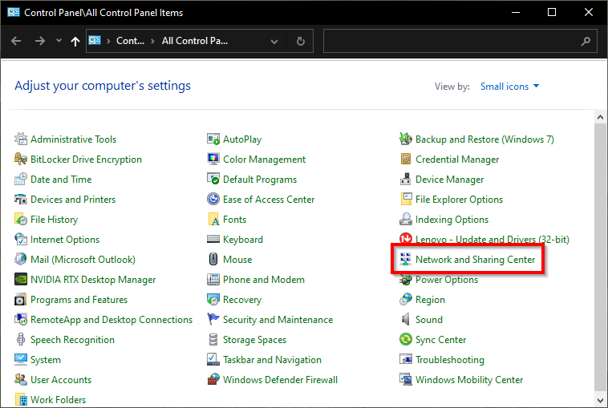

2. Select **Change adapter settings**.  
   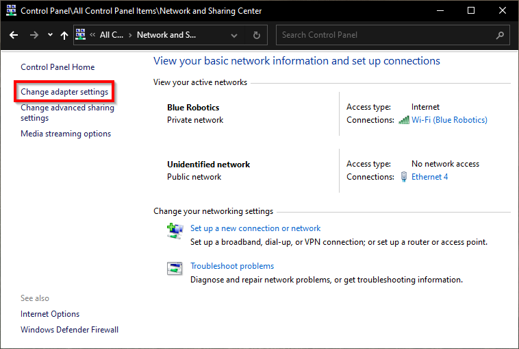

3. Find the **Realtek USB FE Family Controller**, right-click and choose **Properties**.  
   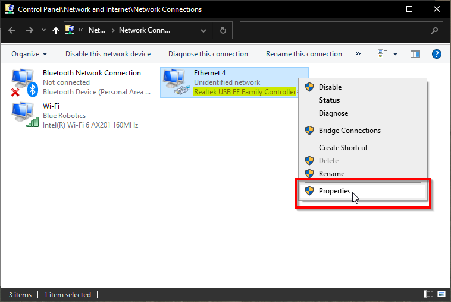

4. Select **Internet Protocol Version 4 (TCP/IPv4)** and click **Properties**.  
   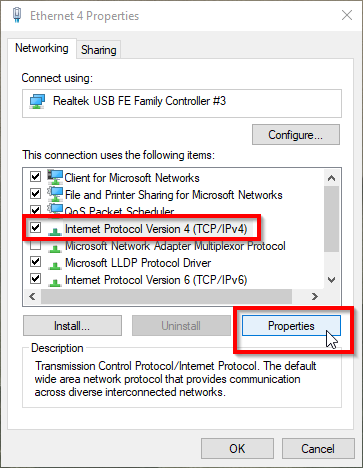

5. Use the following settings:  
   - IP Address: `192.168.2.1`  
   - Subnet Mask: `255.255.255.0`  
   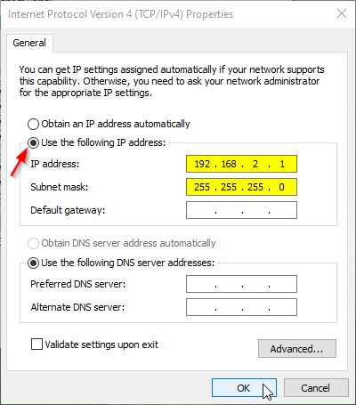

## Firewall Settings

1. Go to **Control Panel** > **Windows Defender Firewall**.  
   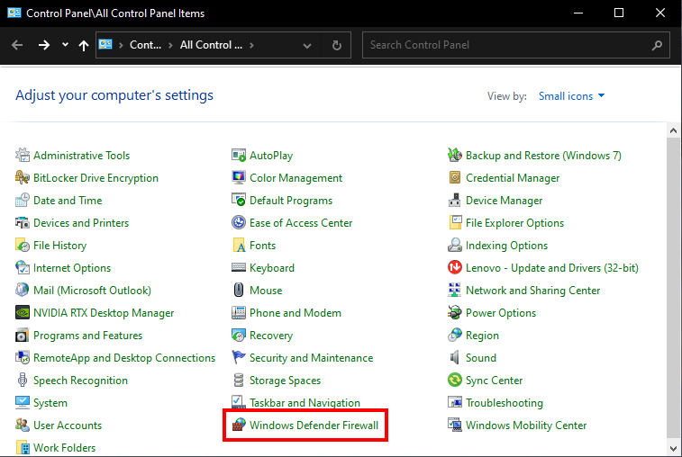

2. Click **Allow an app or feature through Windows Defender Firewall**.  
   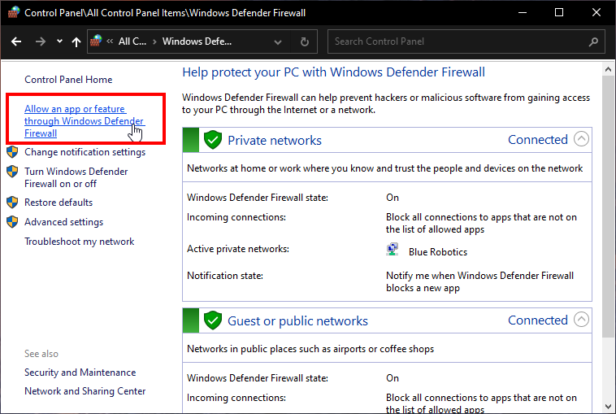

3. Click **Change Settings**, find **QGroundControl** and allow it for **Private** and **Public**.  
   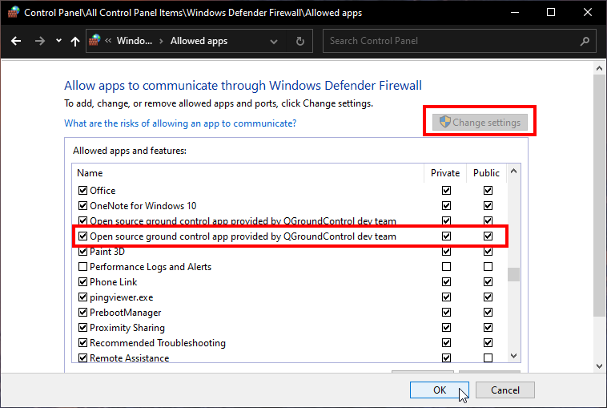

</TabItem>
<TabItem value="macos" label="macOS">

- [QGroundControl for macOS](https://s3.amazonaws.com/downloads.bluerobotics.com/QGC/latest/QGroundControl.dmg)

## Network Setup
### When you are done with the installation process, Follow the following steps: 

1. Go to **System Preferences** > **Network**  
2. Select **USB 10/100 LAN**  
3. Set **Configure IPv4** to **Manually**  
4. Set:  
   - IP Address: `192.168.2.1`  
   - Subnet Mask: `255.255.255.0`  
   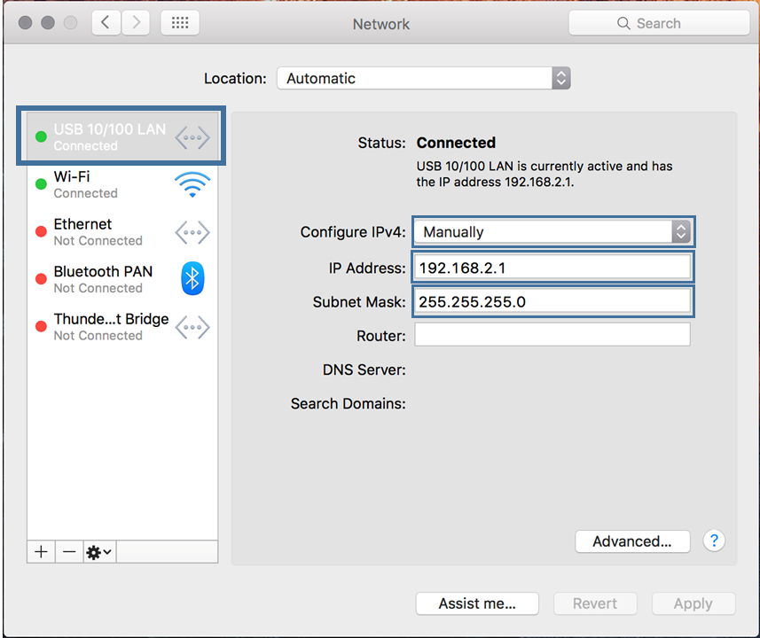

</TabItem>
<TabItem value="ubuntu" label="Linux">

- [QGroundControl for Linux](https://s3.amazonaws.com/downloads.bluerobotics.com/QGC/latest/QGroundControl.AppImage)

## Network Setup
### When you are done with the installation process, Follow the following steps: 

1. Click the Network icon > **Edit Connections...**  
   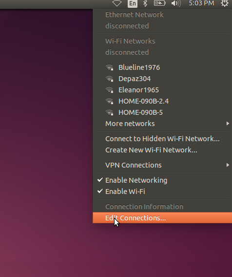

2. Click **Add**  
   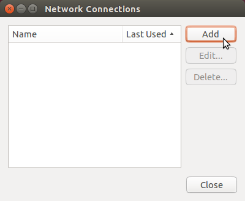

3. Select **Ethernet** and click **Create...**  
   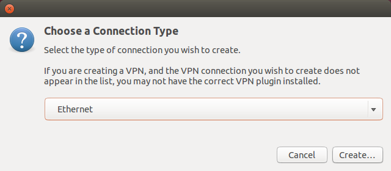

4. Choose your Ethernet adapter from **Device MAC Address**  
   

5. Go to **IPv4 Settings**, set method to **Manual**, and enter:  
   - Address: `192.168.2.1`  
   - Netmask: `255.255.255.0`  
   - Gateway: `0.0.0.0`  
   Click **Save...**  
   

</TabItem>
</Tabs>

# Connecting to QGroundControl

1. With the BlueROV2 still connected and powered on, start the QGroundControl application.  
2. Wait a few seconds for the ROV to auto-connect and for the green parameters bar to finish loading from left to right.  

:::note

If this is the first time setting up the ROV, you will receive a message that additional setup is required.

:::
